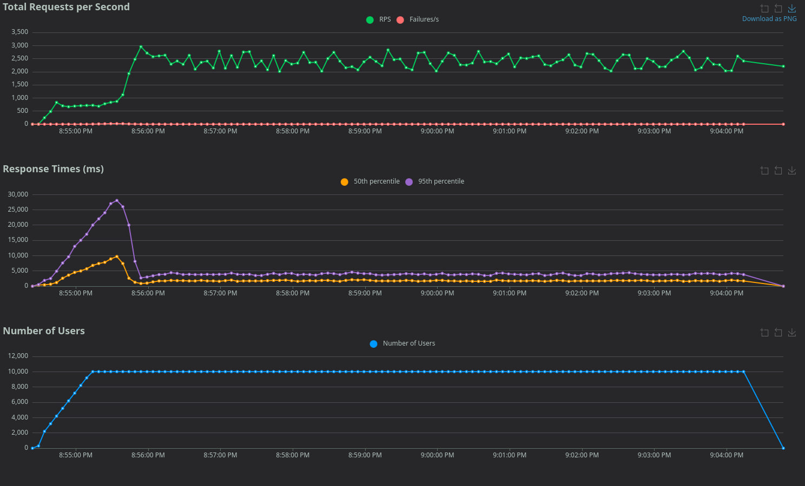

## benchmarks

Tested on:
- Ryzen 9 8945HS
- FastAPI with 9 workers
- PostgreSQL 16 with flags:
```
-c max_connections=500 
-c shared_buffers=512MB 
-c effective_cache_size=1536MB 
-c work_mem=16MB 
-c max_wal_size=2GB
```

### 10k users, 200 users per requests, 4 workers
